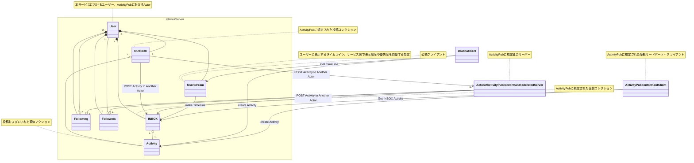

# stlatica ドメインモデル図

```mermaid
classDiagram


    namespace stlaticaServer{
        class User
        class Activity

        class OUTBOX
        class INBOX

        class Following
        class Followers

        class UserStream

    }

    note for User "本サービスにおけるユーザー。ActivityPubにおけるActor"
    note for Activity "投稿およびいいねと類似アクション"
    note for INBOX "ActivityPubに規定された受信コレクション"
    note for OUTBOX "ActivityPubに規定された投稿コレクション"

    note for UserStream "ユーザーに表示するタイムライン。サービス側で表示順序や優先度を調整する想定"
    class stlaticaClient
    note for UserStream "公式クライアント"

    class ActivityPub conformant Client
    note for ActivityPub conformant Client "ActivityPubに規定された準拠サードパーティクライアント"
    class Actor of ActivityPub conformant Federated Server
    note for Actor of ActivityPub conformant Federated Server "ActivityPubに規定連合サーバー"

    User "1" *-- "1" OUTBOX
    User "1" *-- "1" INBOX 
    User "1" *-- "1" Following
    User "1" *-- "1" Followers
    User "1" *-- "1" UserStream
    
    User "0.." --o "o.." Following
    User "0.." --o "o.." Followers
    
    Actor of ActivityPub conformant Federated Server "0.." --o "o.." Following
    Actor of ActivityPub conformant Federated Server "0.." --o "o.." Followers

    OUTBOX "1.." o-- "1" Activity
    INBOX "1.." o-- "1.." Activity

    OUTBOX --> INBOX : POST Activity to Another Actor
    OUTBOX --> Actor of ActivityPub conformant Federated Server : POST Activity to Another Actor
    Actor of ActivityPub conformant Federated Server --> INBOX : POST Activity to Another Actor


    UserStream --> INBOX : make TimeLine
    stlaticaClient --> UserStream : Get TimeLine
    ActivityPub conformant Client --> INBOX : Get INBOX Activity

    stlaticaClient --> Activity : create Activity
    ActivityPub conformant Client --> Activity : create Activity

    
    
```