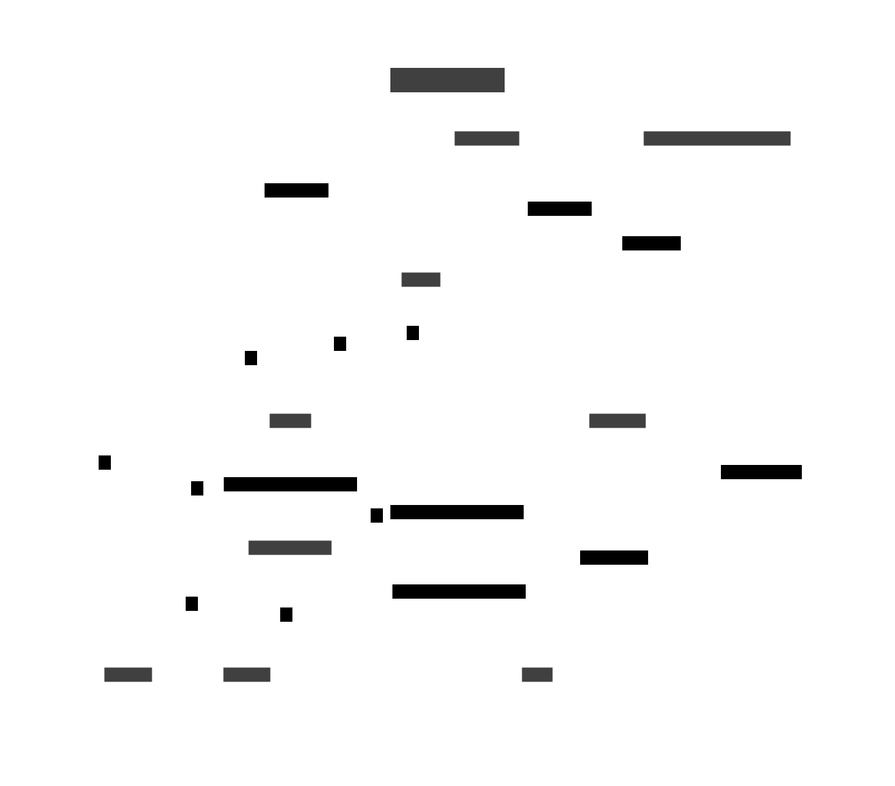

# stlatica ドメインモデル図

## 各クラス詳細

### User

本サービスにおけるユーザー。ActivityPubにおけるActor

### Activity

ActivityPubにおいて規定された投稿などのアクションを指すObject

### INBOX

ActivityPubに規定された受信コレクション

### OUTBOX

ActivityPubに規定された投稿コレクション

### TimeLine Setting

ユーザーに表示するタイムライン。サービス側で表示順序や優先度を調整する想定

### stlaticaClient

公式クライアント

### Federated Server 

ActivityPubに規定された連合サーバー。正式にはActivityPub conformant  Federated Server 

### Federated Server Actor

ActivityPubに規定された連合サーバーのActor

### plat

本サービスにおけるユーザーの投稿の本文にあたるObject。文章、画像など

### Followers

Activity Pubに規定されたFollowされた他連合サーバーのActorのcollection

### Following

Activity Pubに規定されたFollowしている他連合サーバーのActorのcollection