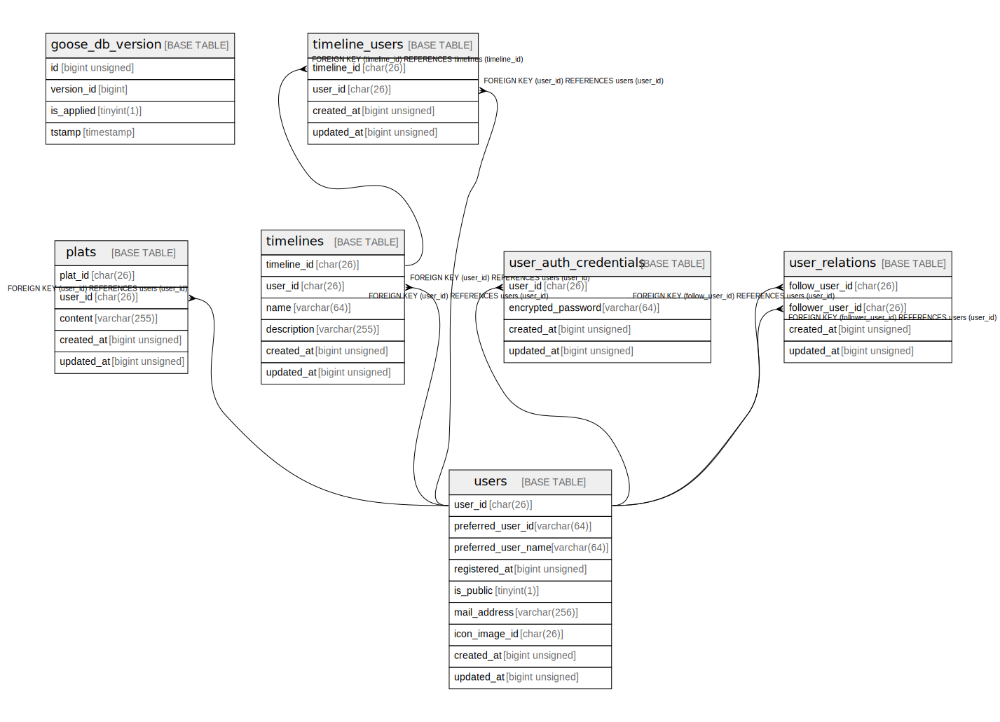

# stlatica

## Tables

| Name | Columns | Comment | Type |
| ---- | ------- | ------- | ---- |
| [goose_db_version](goose_db_version.md) | 4 |  | BASE TABLE |
| [plats](plats.md) | 5 |  | BASE TABLE |
| [timeline_users](timeline_users.md) | 4 |  | BASE TABLE |
| [timelines](timelines.md) | 6 |  | BASE TABLE |
| [user_auth_credentials](user_auth_credentials.md) | 4 |  | BASE TABLE |
| [user_relations](user_relations.md) | 4 |  | BASE TABLE |
| [users](users.md) | 9 |  | BASE TABLE |

## Relations

---

> Generated by [tbls](https://github.com/k1LoW/tbls)
