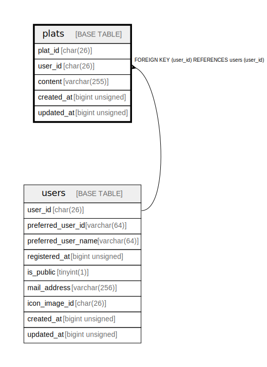

# plats

## Description

<details>
<summary><strong>Table Definition</strong></summary>

```sql
CREATE TABLE `plats` (
  `plat_id` char(26) COLLATE utf8mb4_ja_0900_as_cs NOT NULL COMMENT 'ulid',
  `user_id` char(26) COLLATE utf8mb4_ja_0900_as_cs NOT NULL COMMENT 'user_id',
  `content` varchar(255) COLLATE utf8mb4_ja_0900_as_cs NOT NULL COMMENT 'body text',
  `created_at` bigint unsigned NOT NULL COMMENT 'Unix time',
  `updated_at` bigint unsigned NOT NULL COMMENT 'Unix time',
  PRIMARY KEY (`plat_id`),
  KEY `fk_plats_users` (`user_id`),
  CONSTRAINT `fk_plats_users` FOREIGN KEY (`user_id`) REFERENCES `users` (`user_id`)
) ENGINE=InnoDB DEFAULT CHARSET=utf8mb4 COLLATE=utf8mb4_ja_0900_as_cs
```

</details>

## Columns

| Name | Type | Default | Nullable | Children | Parents | Comment |
| ---- | ---- | ------- | -------- | -------- | ------- | ------- |
| plat_id | char(26) |  | false |  |  | ulid |
| user_id | char(26) |  | false |  | [users](users.md) | user_id |
| content | varchar(255) |  | false |  |  | body text |
| created_at | bigint unsigned |  | false |  |  | Unix time |
| updated_at | bigint unsigned |  | false |  |  | Unix time |

## Constraints

| Name | Type | Definition |
| ---- | ---- | ---------- |
| fk_plats_users | FOREIGN KEY | FOREIGN KEY (user_id) REFERENCES users (user_id) |
| PRIMARY | PRIMARY KEY | PRIMARY KEY (plat_id) |

## Indexes

| Name | Definition |
| ---- | ---------- |
| fk_plats_users | KEY fk_plats_users (user_id) USING BTREE |
| PRIMARY | PRIMARY KEY (plat_id) USING BTREE |

## Relations



---

> Generated by [tbls](https://github.com/k1LoW/tbls)
