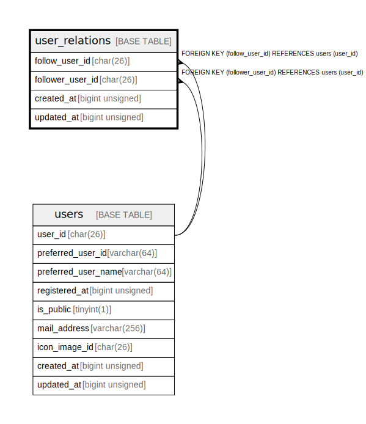

# user_relations

## Description

<details>
<summary><strong>Table Definition</strong></summary>

```sql
CREATE TABLE `user_relations` (
  `follow_user_id` char(26) COLLATE utf8mb4_ja_0900_as_cs NOT NULL COMMENT 'user_id of the followed side',
  `follower_user_id` char(26) COLLATE utf8mb4_ja_0900_as_cs NOT NULL COMMENT 'user_id of the follower side',
  `created_at` bigint unsigned NOT NULL COMMENT 'Unix time',
  `updated_at` bigint unsigned NOT NULL COMMENT 'Unix time',
  PRIMARY KEY (`follow_user_id`,`follower_user_id`),
  KEY `fk_user_relations_follower_user_id` (`follower_user_id`),
  CONSTRAINT `fk_user_relations_follow_user_id` FOREIGN KEY (`follow_user_id`) REFERENCES `users` (`user_id`),
  CONSTRAINT `fk_user_relations_follower_user_id` FOREIGN KEY (`follower_user_id`) REFERENCES `users` (`user_id`)
) ENGINE=InnoDB DEFAULT CHARSET=utf8mb4 COLLATE=utf8mb4_ja_0900_as_cs
```

</details>

## Columns

| Name | Type | Default | Nullable | Children | Parents | Comment |
| ---- | ---- | ------- | -------- | -------- | ------- | ------- |
| follow_user_id | char(26) |  | false |  | [users](users.md) | user_id of the followed side |
| follower_user_id | char(26) |  | false |  | [users](users.md) | user_id of the follower side |
| created_at | bigint unsigned |  | false |  |  | Unix time |
| updated_at | bigint unsigned |  | false |  |  | Unix time |

## Constraints

| Name | Type | Definition |
| ---- | ---- | ---------- |
| fk_user_relations_follow_user_id | FOREIGN KEY | FOREIGN KEY (follow_user_id) REFERENCES users (user_id) |
| fk_user_relations_follower_user_id | FOREIGN KEY | FOREIGN KEY (follower_user_id) REFERENCES users (user_id) |
| PRIMARY | PRIMARY KEY | PRIMARY KEY (follow_user_id, follower_user_id) |

## Indexes

| Name | Definition |
| ---- | ---------- |
| fk_user_relations_follower_user_id | KEY fk_user_relations_follower_user_id (follower_user_id) USING BTREE |
| PRIMARY | PRIMARY KEY (follow_user_id, follower_user_id) USING BTREE |

## Relations



---

> Generated by [tbls](https://github.com/k1LoW/tbls)
