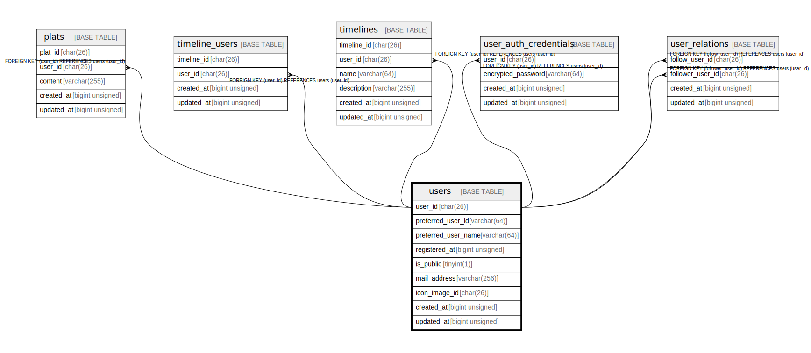

# users

## Description

<details>
<summary><strong>Table Definition</strong></summary>

```sql
CREATE TABLE `users` (
  `user_id` char(26) COLLATE utf8mb4_ja_0900_as_cs NOT NULL COMMENT 'ulid',
  `preferred_user_id` varchar(64) COLLATE utf8mb4_ja_0900_as_cs NOT NULL COMMENT 'preferred user id',
  `preferred_user_name` varchar(64) COLLATE utf8mb4_ja_0900_as_cs NOT NULL COMMENT 'preferred user name',
  `registered_at` bigint unsigned NOT NULL COMMENT 'Unix time',
  `is_public` tinyint(1) NOT NULL COMMENT 'user is public',
  `mail_address` varchar(256) COLLATE utf8mb4_ja_0900_as_cs NOT NULL COMMENT 'mail address',
  `icon_image_id` char(26) COLLATE utf8mb4_ja_0900_as_cs NOT NULL COMMENT 'icon image id',
  `created_at` bigint unsigned NOT NULL COMMENT 'Unix time',
  `updated_at` bigint unsigned NOT NULL COMMENT 'Unix time',
  PRIMARY KEY (`user_id`),
  UNIQUE KEY `mail_address` (`mail_address`),
  UNIQUE KEY `idx_users_preferred_user_id` (`preferred_user_id`),
  UNIQUE KEY `idx_users_mail_address` (`mail_address`)
) ENGINE=InnoDB DEFAULT CHARSET=utf8mb4 COLLATE=utf8mb4_ja_0900_as_cs
```

</details>

## Columns

| Name | Type | Default | Nullable | Children | Parents | Comment |
| ---- | ---- | ------- | -------- | -------- | ------- | ------- |
| user_id | char(26) |  | false | [plats](plats.md) [timeline_users](timeline_users.md) [timelines](timelines.md) [user_auth_credentials](user_auth_credentials.md) [user_relations](user_relations.md) |  | ulid |
| preferred_user_id | varchar(64) |  | false |  |  | preferred user id |
| preferred_user_name | varchar(64) |  | false |  |  | preferred user name |
| registered_at | bigint unsigned |  | false |  |  | Unix time |
| is_public | tinyint(1) |  | false |  |  | user is public |
| mail_address | varchar(256) |  | false |  |  | mail address |
| icon_image_id | char(26) |  | false |  |  | icon image id |
| created_at | bigint unsigned |  | false |  |  | Unix time |
| updated_at | bigint unsigned |  | false |  |  | Unix time |

## Constraints

| Name | Type | Definition |
| ---- | ---- | ---------- |
| idx_users_mail_address | UNIQUE | UNIQUE KEY idx_users_mail_address (mail_address) |
| idx_users_preferred_user_id | UNIQUE | UNIQUE KEY idx_users_preferred_user_id (preferred_user_id) |
| mail_address | UNIQUE | UNIQUE KEY mail_address (mail_address) |
| PRIMARY | PRIMARY KEY | PRIMARY KEY (user_id) |

## Indexes

| Name | Definition |
| ---- | ---------- |
| PRIMARY | PRIMARY KEY (user_id) USING BTREE |
| idx_users_mail_address | UNIQUE KEY idx_users_mail_address (mail_address) USING BTREE |
| idx_users_preferred_user_id | UNIQUE KEY idx_users_preferred_user_id (preferred_user_id) USING BTREE |
| mail_address | UNIQUE KEY mail_address (mail_address) USING BTREE |

## Relations



---

> Generated by [tbls](https://github.com/k1LoW/tbls)
